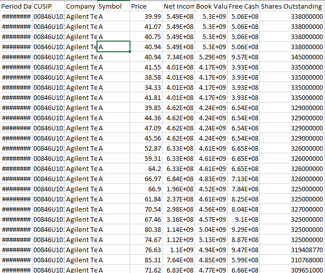

## 1. Scraping financial data from IEX Cloud API
### Collecting data from IEX Cloud in real time.

## 2. Cleaning Data
### Using Pandas, Cleaning data

## 3. Visualize Data
### Using Plotly, show chart for analysis

